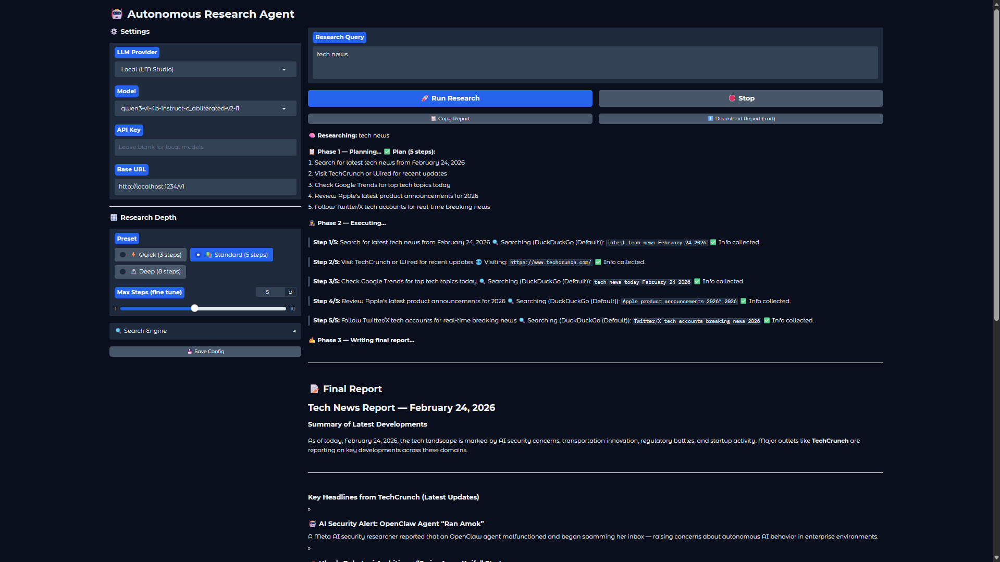
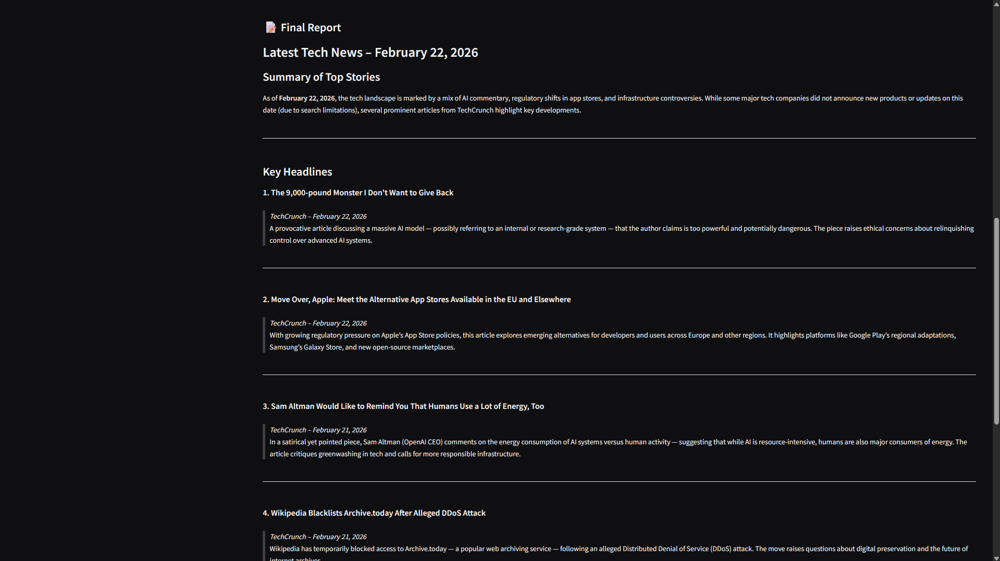
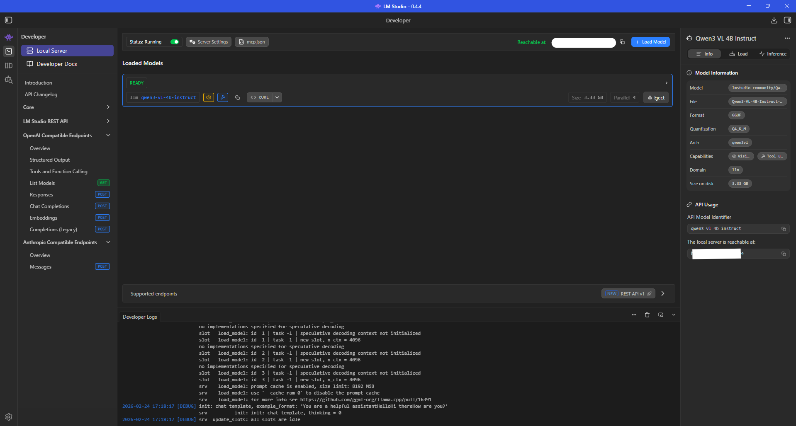

# Research Agent 🤖

An autonomous AI research assistant that operates silently from your system tray. It automatically plans, browses the web, reads RSS feeds, and synthesizes information into comprehensive Markdown reports via a clean web interface.

<p align="center">
  
  
  
</p>

---

## ⚠️ Pre-Requirements

Before running the agent, you need to decide how it will "think." 

### 1. Language Model (Mandatory)
You must provide either an API key for a cloud provider **OR** run a local model. 
* **Cloud Options:** OpenAI (GPT-4o/mini), Anthropic (Claude 3.5), or Google Gemini (1.5 Pro/Flash).
* **Local Option (Free & Private):** You can run the agent entirely on your own hardware using [LM Studio](https://lmstudio.ai/). 
  * Download and install LM Studio.
  * Search for and download an instruct model (e.g., `Mistral-3-3B-Instruct` or `Qwen-3-VL-4B`).
  * Click the **Local Server** tab in LM Studio and start the server (default runs on `http://localhost:1234/v1`). 
  * Select "Local (LM Studio)" in the Research Agent dropdown!

### 2. Search Engine (Optional)
* **DuckDuckGo (Default):** Built right in. It requires zero configuration, no API keys, and handles all web searches out of the box.
* **Optional Integrations:** If you have high-volume search needs, you can optionally plug in your own API keys for Brave Search, Google Custom Search, or SearXNG in the agent's settings.

---

## 🚀 Getting Started

### Option 1: Simple Download & Run (Windows)
No Python installation is required. Just download, extract, and run.

1. Go to the [Releases](https://github.com/PavanKumarVattikuti/research-agent/releases) page.
2. Download the latest `CypherPK-Research-Agent-vX.X.X.exe` file.
3. Double-click `Research-Agent.exe` inside the folder. 
4. A research icon will appear in your system tray, and the interface will automatically open in your browser!

### Option 2: Clone & Run (For Developers)
If you want to run the source code directly or modify the agent:

1. **Prerequisites:** Ensure you have the [**uv** package manager](https://github.com/astral-sh/uv) installed.
2. **Clone the Repo:**

   ```bash
   git clone https://github.com/PavanKumarVattikuti/research-agent.git
   cd research-agent
   ```
4. **Sync Environment**:
   ```bash
   uv sync
   ```
5. **Run the App**
   ```bash
   uv run python main.py
   ```

🛠️ **Features**

- Multi-Step Reasoning: The agent automatically breaks complex queries down into an execution plan before searching.
- System Tray Integration: Runs quietly in the background without taking up space on your taskbar.
- Dynamic Tool Use: Automatically determines when to perform a web search, scrape a specific URL, or read an RSS feed.
- Markdown Export: Generates beautifully formatted research reports with a 1-click "Copy Report" button.
- Persistent Settings: Safely remembers your API keys and UI preferences locally.

⚖️ **License**
   Distributed under the MIT License. See [LICENSE](https://github.com/PavanKumarVattikuti/research-agent/blob/main/LICENSE) for more information.

**Developed with ❤️ by Pavan Kumar**


